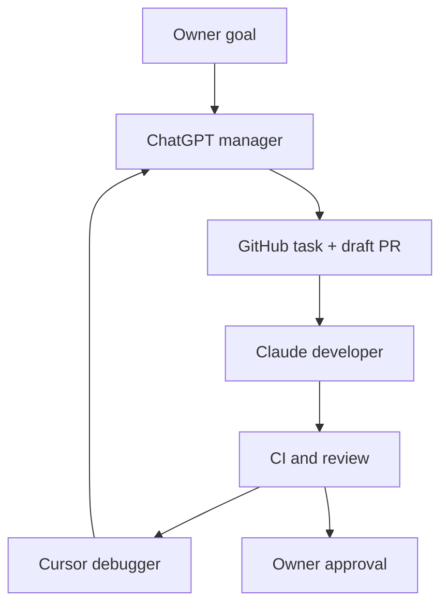

# DropPilot agent bridge V1

This control plane keeps GitHub as the only shared state between the agents:

- **ChatGPT/Codex — manager:** turns the owner's goal into one bounded task,
  creates/inspects the issue and PR, checks evidence, and decides the next
  worker instruction.
- **Claude — developer:** produces a local source patch for the approved task.
- **Cursor — debugger:** performs a read-only independent diagnosis and posts
  findings to the PR.
- **Repository owner — approver:** owns product decisions, merge approval, and
  every production action.

GitHub stores the task contract, commits, CI evidence, worker reports, and final
decision. A trusted workflow posts a bounded PR comment when application CI
finishes. ChatGPT's webhook supports human comments; bot comments are not a
guaranteed wake-up. If the manager has not resumed, the owner comments
"review results" on the PR. Agents do not call one another
directly and do not share local credentials.



## Why the bridge lives on `main`

GitHub loads comment-triggered workflows and issue templates from the
repository's default branch. This repository's default branch is `main`, while
application development targets `develop`. The bridge therefore lives on
`main`, but its policy accepts only same-repository PRs whose base is
`develop`. Worker code is always inspected at an exact 40-character head SHA.

The application tree is not deployed or rebased by installing this bridge.

## One-time activation

1. Independently review and merge the bridge-only PR into `main`.
2. Generate a Claude subscription token with `claude setup-token`, then add it
   as the repository Actions secret `CLAUDE_CODE_OAUTH_TOKEN`. An Anthropic API
   key is also supported upstream, but this V1 is deliberately wired to the
   subscription-token input. The Claude GitHub App is not required because the
   bridge uses the lower-level base action without GitHub write access.
3. Create a fine-grained, expiring GitHub personal access token restricted to
   this repository with **Contents: read and write** only. Add it as
   `AGENT_BRANCH_PUSH_TOKEN`. Do not grant Administration, Environments,
   Secrets, or Workflows access. This token is exposed only to the trusted
   patch-application job so its commit starts normal application CI.
4. In Cursor, create a user or service-account API key and add it as the
   repository Actions secret `CURSOR_API_KEY`. V1 uses the local SDK runtime on
   GitHub's ephemeral runner, so a Cursor GitHub repository connection is not
   required.
5. Keep Actions enabled. Never paste either secret into an issue, PR, file,
   shell command shown in a report, or ChatGPT conversation.

Official setup references:

- [Claude Code GitHub Actions](https://code.claude.com/docs/en/github-actions)
- [Claude Code Base Action](https://github.com/anthropics/claude-code-base-action)
- [Cursor Python SDK](https://cursor.com/docs/sdk/python)

## Manager runbook

### 1. Open one task

Use the **Agent-managed task** issue form. The issue must define one phase with
a goal, scope, observable acceptance criteria, forbidden actions, and exact
verification. Large goals are split into sequential tasks.

### 2. Create a safe handoff PR

The manager:

1. Reads the exact current `origin/develop` SHA.
2. Creates a new same-repository branch from that SHA using `feature/`, `feat/`,
   `fix/`, `chore/`, `docs/`, or `test/`.
3. Adds `docs/agent-tasks/issue-<number>.md` with the issue contract. This
   auditable first commit also gives GitHub a diff from which to open the PR.
4. Opens a **draft** PR to `develop` titled `[Agent] <bounded outcome>` using
   the agent-managed PR template.
5. Confirms the PR base, head repository, head branch, and head SHA before
   invoking a worker.

### 3. Ask Claude to develop

The owner or ChatGPT manager comments on the PR:

```text
@claude implement only the Manager task and acceptance criteria in this PR.
Read CLAUDE.md first. Keep the PR in draft, run the required gates, report raw
results and limitations, then stop. Do not merge or deploy.
```

The workflow refuses a non-owner comment, non-draft or fork PR, non-`develop`
base, stale base ancestry, protected head branch, non-agent title, missing PR
contract, or abbreviated commit SHA. It also refuses real environment/key files, build/log/evidence
artefacts, GitHub workflows, agent instruction/configuration files, bridge
self-modification, and PRs over 100 files before a worker is contacted.

Claude receives a maximum of 30 turns and a 45-minute job timeout. Claude Code
runs with `--safe-mode --restricted --permission-prompts none` and its actual `--tools` inventory restricted to
read/search/edit/write: no shell, network, hooks, skills, plugins, MCP,
subagent, GitHub token, or OIDC token. Claude cannot commit or push. A separate trusted job accepts only a
regular UTF-8 text patch of at most 100 files / 2 MB, rechecks the exact PR SHA,
refuses secrets and protected paths, applies it in a fresh checkout, and pushes
with `--force-with-lease` to that validated feature branch only. Existing CI,
not Claude's prose, performs verification.

Safe mode preserves OAuth authentication while disabling discovered customizations.
Restricted mode confines file tools to the working directories and excludes user
and project settings. Do not replace these flags with `--bare`: bare mode ignores
subscription OAuth credentials. The pinned action installs Claude Code 2.1.269,
which supports these flags. Hosted runners must have no custom managed policies.

### 4. Ask Cursor to diagnose

Use Cursor when CI fails, evidence conflicts, or an independent debugging pass
is useful:

```text
/cursor-debug Find the root cause of the failing publish-integrity checks.
Classify product defects separately from harness or environment failures.
```

Cursor runs against an exact-SHA checkout on an ephemeral GitHub runner. The
SDK is configured with only `read`, `grep`, `glob`, and `ls`; project settings,
edit, shell, web, MCP, and subagent tools are not offered. Git credentials are
not persisted and a post-run check fails if any unexpected file changed. The
Cursor step receives no GitHub token; a later step posts its report. Cursor may
diagnose, but it cannot run commands, edit, commit, push, merge, deploy, read
process secrets, or contact real providers.

Worker handoffs and CI notices use GitHub's REST issue-comments endpoint for
the PR conversation with the existing `issues: write` permission. They do not
use `gh pr comment` (GraphQL), which rejected the initial smoke report with
`Resource not accessible by integration`. This correction does not add PR
write permission to either worker.

### 5. Manager decision loop

The manager compares Claude's claims with the diff, CI, Cursor findings, the
repository constitution, and the task's acceptance criteria.

- If evidence is incomplete: give Claude one precise corrective instruction.
- If the root cause is unclear: request one Cursor diagnostic.
- If the PR is correct: publish an acceptance report and ask the owner for
  merge approval.
- Never merge merely because an agent says "ready".
- Never begin the next phase before the current phase is accepted.

Merge and deployment are separate decisions. This bridge never auto-merges and
contains no deployment workflow.

Application CI completion is bridged back into this loop by
`agent-manager-wakeup.yml`. It accepts only the repository's `CI` workflow for
the exact current SHA of one open, draft, same-repository `[Agent]` PR. Its
comment records completion, not an acceptance decision. The owner may need to
comment "review results" to trigger the human-comment webhook. Fully unattended
CI-to-manager continuation is not verified in V1.

## Security boundary

| Control | V1 behaviour |
|---|---|
| Trigger actor | Exact GitHub login `Adnan-Zulfiqar` only |
| Repository | Exact private repository only |
| PR source | Same repository; forks refused |
| PR target | `develop` only |
| PR state | Open draft only; current `develop` must be its ancestor |
| Worker head | Approved feature/fix/chore/docs/test prefix; never `main` or `develop` |
| Changed paths | Real env/key files, artefacts, bridge files, and >100-file PRs refused |
| Claude credential | Available only to a no-shell, no-GitHub-token prepare job |
| Claude mutation | Local text patch only; validated again in a clean trusted job |
| Branch push token | Separate job; exact feature ref + force-with-lease; never sent to Claude |
| Cursor credential | Available only to the Cursor SDK step |
| Cursor GitHub write token | Not present during the Cursor run |
| Cursor mutation | Local SDK allowlists read/search/list tools only; project settings disabled |
| Production | No production secrets, data, provider calls, merge, or deployment |
| Cost/runaway control | Owner-only command, per-PR concurrency, turn/time limits |

The policy is duplicated in tests because a safety rule without a failing
negative test is not considered implemented.

## Current platform limitation

`develop` is currently unprotected because GitHub rejected branch protection
for this private repository on its present plan. Neither worker receives a
write token, and the trusted Claude apply job can target only the validated
feature branch. However, without a protected branch GitHub still cannot make
CI or review status a hard merge requirement. Until protection is available:

- the manager must never merge without the owner's explicit approval;
- the owner must avoid direct pushes to `main` and `develop`;
- CI status is evidence, not an enforced server-side gate.

This limitation prevents calling V1 fully autonomous or production-grade. It
does not prevent a safe, supervised one-day bridge.

## Verification

The bridge self-check workflow compiles its Python scripts and runs the policy
unit tests on every bridge PR and push to `main`. Activation smoke tests are:

1. A non-owner or non-agent comment does not start a billable worker job.
2. A valid owner `@claude` comment produces one policy-validated feature-branch
   patch; the worker itself has no GitHub write access.
3. A valid owner `/cursor-debug` comment posts one read-only report.
4. A fork, `main`/`develop` head, wrong base, malformed SHA, or missing contract
   is refused before a worker API is contacted.
5. Normal application CI still runs on the agent PR and no workflow merges it.

## One-day boundary

A one-day V1 includes the control-plane files, negative policy tests, a draft
PR, connection of the three narrowly scoped secrets by the owner, and one
disposable smoke task. It does **not** include unattended production changes,
perfect multi-agent autonomy, custom billing dashboards, or replacement for
GitHub branch protection.
